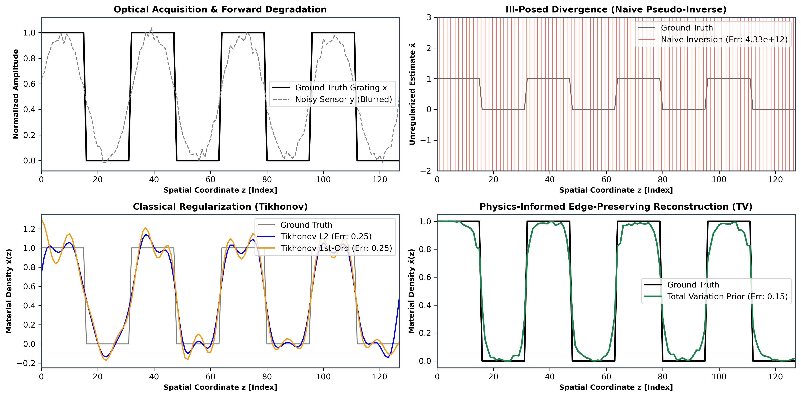

# 1D Ill-Conditioned Operator Inversion & Regularization Benchmark

A numerical benchmark evaluating singular value decay, noise amplification, and edge-preserving variational recovery on an ill-conditioned 1D discrete linear forward operator.

---

## 1. Forward Model Formulation

We study the discrete linear inverse problem:

$$y = A x + \eta$$

where:
- $x \in \mathbb{R}^{100}$ is a ground-truth 1D piecewise-constant step profile (representing a sharp boundary/trench).
- $A \in \mathbb{R}^{100 \times 100}$ is a discrete symmetric Toeplitz convolution matrix modeling severe low-pass blurring.
- $\eta \sim \mathcal{N}(0, \sigma^2 I)$ is additive Gaussian noise ($\sigma = 0.03$).

### Spectral Conditioning & Instability
Singular Value Decomposition (SVD) of the forward operator reveals severe ill-conditioning:

$$A = U \Sigma V^T, \quad \kappa(A) = \frac{\sigma_{\max}}{\sigma_{\min}} \approx 3.38 \times 10^{16}$$

With the singular value spectrum dropping to $\sigma_{\min} \sim \mathcal{O}(10^{-17})$, direct Moore-Penrose pseudo-inversion diverges catastrophically under noise:

$$x_{\text{naive}} = A^\dagger y = \sum_{i=1}^{100} \frac{u_i^T y}{\sigma_i} v_i = x_{\text{true}} + \sum_{i=1}^{100} \frac{u_i^T \eta}{\sigma_i} v_i$$

As $\sigma_i \to 0$, the high-frequency noise components explode, causing unregularized reconstruction error to diverge ($L_2$ error $> 10^{10}$).

---

## 2. Regularized Solvers & Benchmarks

We evaluate three stabilization schemes against naive unregularized inversion:

1. **0th-Order Tikhonov (Ridge Regression):**
   $$x_\alpha = (A^T A + \alpha I)^{-1} A^T y$$
   Stabilizes the inversion against noise amplification, but over-smooths sharp step boundaries.

2. **1st-Order Tikhonov (Gradient Damping):**
   $$x_\alpha = (A^T A + \alpha D^T D)^{-1} A^T y$$
   Penalizes first-order differences, introducing ramp artifacts across discontinuous interfaces.

3. **Physics-Informed Variational Inversion (Total Variation Prior):**
$$
\min_{\hat{x}} \frac{1}{2N} \| A\hat{x} - y \|_2^2 + \lambda_{\mathrm{TV}} \sum_{i=1}^{N-1} \sqrt{(\hat{x}_{i+1} - \hat{x}_i)^2 + \epsilon} \quad \text{subject to} \quad \hat{x} \in [0, 1]
$$
   Implemented in PyTorch using autograd optimization (Adam) to enforce piecewise-constant edge preservation.

### Comparative Inversion Performance

| Solver Method | Prior / Regularization | Relative $L_2$ Error | Notes |
| :--- | :--- | :--- | :--- |
| **Naive Pseudo-Inverse** | None | $4.326 \times 10^{10}$ | Catastrophic noise explosion |
| **0th-Order Tikhonov** | $L_2$ Energy ($\|x\|_2^2$) | $0.2490$ | Smooths step boundaries |
| **1st-Order Tikhonov** | $L_2$ Gradient ($\|Dx\|_2^2$) | $0.2466$ | Ramp/slope artifacts |
| **Total Variation (PyTorch)** | $L_1$ Gradient Prior | **$0.1550$** | **Sharp edge-preserving recovery** |

---

## 3. Numerical Verification

*Comparison of the true step profile, corrupted observation $y$, divergent pseudo-inverse, and regularized reconstructions (Tikhonov vs. Total Variation).*

---

## 4. Code Structure

- `forward_operators/`: Generates the 1D discrete blur kernel, adds Gaussian noise, and computes SVD condition number diagnostics.
- `solvers/`: Closed-form matrix routines for Tikhonov regularization and PyTorch autograd engine for Total Variation minimization.
- `benchmarks/`: Runs comparative evaluations, outputs relative $L_2$ errors, and generates `metrology_inversion.png`.