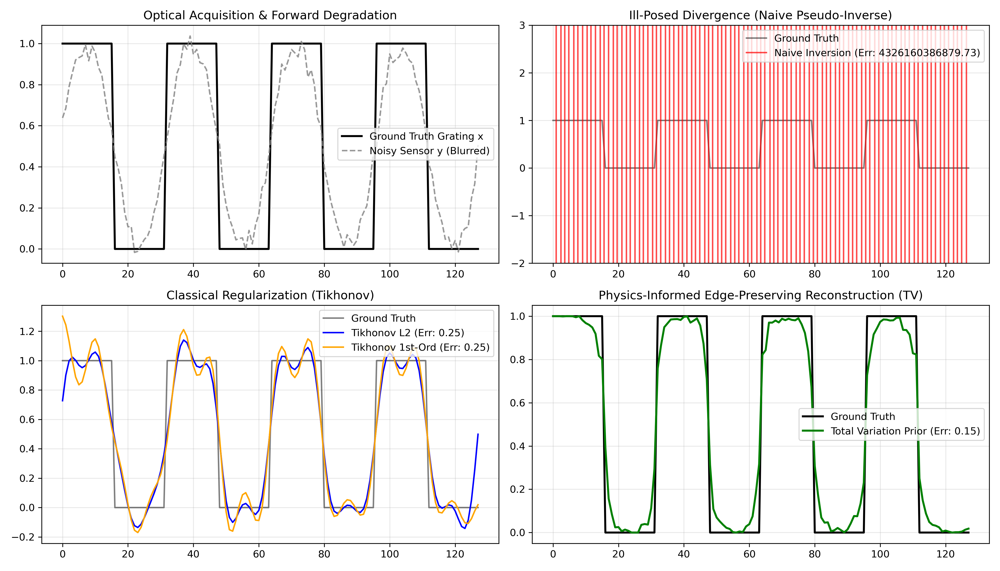

# Ill-Conditioned Optical Operator Inversion for Sub-Wavelength Metrology

This repository provides a numerical benchmark evaluating regularized and physics-informed inverse solvers for severely ill-posed forward operators in optical scatterometry.

## Forward Model Formulation
The forward measurement process maps a 1D sub-wavelength nanoscale grating profile $x \in \mathbb{R}^N$ to a degraded sensor observation array $y \in \mathbb{R}^N$:

$$y = Ax + \eta, \quad \eta \sim \mathcal{N}(0, \sigma^2 I)$$

where $A \in \mathbb{R}^{N \times N}$ is a discrete symmetric Toeplitz convolution matrix representing the low-pass point spread function (PSF) of the optical acquisition system.

## Spectral Conditioning & Instability
Singular Value Decomposition (SVD) of the discrete forward operator reveals severe ill-conditioning:

$$A = U \Sigma V^T, \quad \kappa(A) = \frac{\sigma_{\max}}{\sigma_{\min}} \approx 3.38 \times 10^{16}$$

With $\sigma_{\min} \sim \mathcal{O}(10^{-17})$, direct unregularized Moore-Penrose pseudo-inversion diverges catastrophically under additive Gaussian noise ($\sigma = 0.03$):

$$x_{\text{naive}} = A^\dagger y = \sum_{i=1}^N \frac{u_i^T y}{\sigma_i} v_i \implies \lim_{\sigma_i \to 0} \frac{u_i^T \eta}{\sigma_i} \to \infty$$

Resulting in a relative $L_2$ error exceeding $4 \times 10^{10}$.

### Solvers & Benchmark Results
We evaluate three stabilization schemes against naive inversion:

1. **0th-Order Tikhonov Regularization (Ridge Regression):**
   $$\min_x \|Ax - y\|_2^2 + \alpha \|x\|_2^2 \implies x = (A^T A + \alpha I)^{-1} A^T y$$

2. **1st-Order Tikhonov Regularization (Gradient Damping):**
   $$\min_x \|Ax - y\|_2^2 + \alpha \|Dx\|_2^2 \implies x = (A^T A + \alpha D^T D)^{-1} A^T y$$

3. **Physics-Informed Variational Inversion (Total Variation Prior):**
$$\min_{\hat{x}} \frac{1}{2N} |A\hat{x} - y|2^2 + \lambda{\text{TV}} \sum_{i=1}^{N-1} \sqrt{(\hat{x}_{i+1} - \hat{x}_i)^2 + \epsilon} \quad \text{subject to} \quad \hat{x} \in [0, 1]$$

| Solver Method | Relative $L_2$ Error | Notes |
| :--- | :--- | :--- |
| **Naive Pseudo-Inverse** | $4.326 \times 10^{10}$ | Catastrophic noise explosion |
| **Tikhonov ($L_2$)** | $0.2490$ | Smooths trench boundaries |
| **Tikhonov (1st-Order)** | $0.2466$ | Suppresses high-frequency ripple |
| **Total Variation (PyTorch Autograd)** | **$0.1550$** | Sharp edge-preserving recovery |

